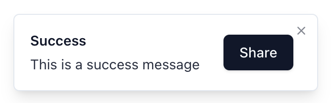

# shadcn_django

[](https://pypi.org/project/shadcn_django)
[](https://github.com/copier-org/copier)

Beautifully designed components that you can copy and paste into your apps, based on [shadcn/ui](https://ui.shadcn.com/).

This is an unofficial Django port of [shadcn/ui](https://ui.shadcn.com/). This project is not affiliated with shadcn.

Components are built with Tailwind CSS and Alpine.js and are HTMX-compatible, making them highly customizable and interactive.

`shadcn_django` provides a CLI tool that allows you to initialize and add shadcn-style components to your Django templates.

Docs: https://shadcn-django.com

## Features

- 🧩 Add components individually as needed
- 🎨 Based on Tailwind CSS for beautiful, responsive styling
- 🚀 Easy initialization of shadcn component architecture in Django projects
- ⚙️ Uses Alpine.js for interactive functionality
- 🛠️ Simple CLI commands for easy distribution
- 📦 Automatically installs component dependencies

## An Example of a component (Toast with an action button)

```html
<div class="p-5" x-data>
  <c-toast.trigger variant="outline" toast_target="toast-success">
    Show Success Toast
  </c-toast.trigger>
</div>

<c-toast id="toast-success">
  <c-toast.content
    type="default"
    title="Success"
    description="This is a success message"
  >
    <c-button>Share</c-button>
  </c-toast.content>
</c-toast>
```



## Installation

> **This is not a component library that you _install_. It is how you build your component library.**

Use the CLI to initialize and add components without the need for installing it in your Django project.

```bash
uvx shadcn_django@latest --help
```

or, if you use `pipx`:

```bash
pipx run shadcn_django@latest --help
```

## Getting Started

### 0. Add `django-cotton` to your Django project

`shadcn_django` uses `django-cotton` to manage the component architecture, because of it's elegant html like syntax.
It is also interoperable with django templates, so you won't have to switch over your entire project.

See `django-cotton` [installtion instructions](https://django-cotton.com/docs/quickstart).

### 1. Initialize shadcn-django in your project

```bash
uvx shadcn_django init
```

This will:

- Create a `templates/cotton` directory for your components
- Add the necessary Tailwind configuration files
- Set up the CSS variables for shadcn's design system

### 2. Set up Tailwind CSS

Make sure you have Tailwind CSS and Alpine.js installed:

You can use npm or yarn to install `tailwindcss`:

```bash
npm install -D tailwindcss tw-animate-css
```

or, you can also use `django-tailwind-cli` if you don't want to use `node`,
and follow the manual installation instructions for `tw-animate-css` [here](https://github.com/wombosvideo/tw-animate-css?tab=readme-ov-file#manual-download)

See alpinejs docs for installation instructions: https://alpinejs.dev/installation

Add the CSS and Alpine.js to your base template `<head>` tag:

```html
<!-- Tailwind CSS output file -->
<link rel="stylesheet" href="" />

<!-- Alpine.js tag - directly from CDN (not recommended for production) -->
<script defer src="https://unpkg.com/alpinejs@3.x.x/dist/cdn.min.js"></script>
```

Run Tailwind to generate your CSS:

```bash
npx @tailwindcss/cli -i input.css -o static/css/output.css --watch
```

### 3. Add components

List available components:

```bash
uvx shadcn_django list
```

Add a component:

```bash
uvx shadcn_django add button
```

This will add the button component and any of its dependencies to your `templates/cotton` directory.

## Using Components in Django Templates

After adding components, you can use them in your Django templates:

```html
<div>
  <c-button variant="outline">Cancel</c-button>
  <c-button variant="default">Submit</c-button>
</div>
```

## Customization

When you use the CLI to add components, they are copied into your project folder.
**You own the components and can customize them as you see fit.**

All components use Tailwind CSS classes and can also be customized by passing additional classes:

```html
<c-button variant="default" class="w-full mt-4" />
```

## Contributing

Contributions are welcome! Feel free to open issues or submit pull requests.

## Prior Art

- Shadcn UI for React: https://ui.shadcn.com/
- Shadcn for Vue: https://www.shadcn-vue.com/
- Shadcn for svelte: https://www.shadcn-svelte.com/
- Shadcn for JinjaX templates: https://components.basicmachines.co/

## License

MIT
